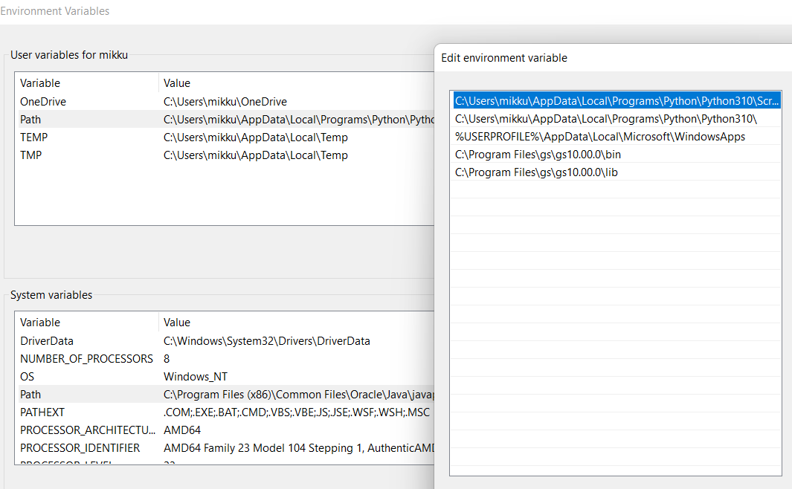

Gradussa piti saada Doppler tomografian lopputuloksina saadut .ps kuvat (3kpl) yhdistettyä yhdeksi .pdf tiedostoksi. Scripti ajetaan Jupyter notebookissa, ja ohjeet tämän käyttöön löytyvät myös sieltä. Ohessa myös H_alpha tiedostot testailua varten.

---

Tämän sai helpoiten toteutettua hyödyntämällä ps2pdf14 komentoa, joka on osa Ghostscript ohjelmistoa. 

Ubuntussa tämä taitaa olla jo valmiina osana käyttistä, mutta Windowsilla se pitää [asentaa](https://www.ghostscript.com/releases/gsdnld.html)

### HUOM! Windowsin "Enviromental Variables" paikan PATH sisältöihin pitää lisätä (KATSO oma kansiopaikka tuolle gs kansiolle): 
  * User variablesin PATH:iin:
1. C:\Program Files\gs\gs10.00.0\bin
2. C:\Program Files\gs\gs10.00.0\lib

  * System variables PATH:iin:
1. C:\Program Files\gs\gs10.00.0\bin

