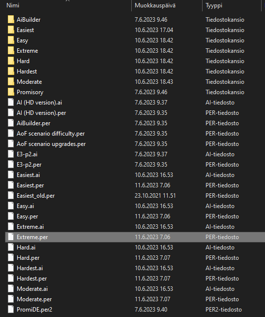

# Separate AoE II Definitive Edition AI Difficulties
---
## Scripti, joka luo AoE II Definitive Editioniin tekoälyt eri vaikeusasteille

Normaalisti AoE II DE voit valita vain kiinteän vaikeusasteen KAIKILLE tekoälypelaajille

1kpl Easy + 1kpl Moderate + 1kpl Extreme on esimerkiksi mahdoton normaalisti.

## Tämä scripti katsoo tekoälyn ohjetiedostoja (.per), ja käsittelee siellä olevat "if, else, elif, or, and" jne. komennot siten, että jokaiselle vaikeusasteelle luodaan omat .per tiedostot.

Esim. "researches.per" tiedostossa rivillä 24 lukee: #load-if-not-defined DIFFICULTY-MODERATE

Tämä if-not ehto suljetaan rivillä 39: #end-if

Jotta saadaan erillinen moderate vaikeusasteen botti, tässä kyseisessä tilanteessa KAIKKI tämän ehdollistuksen sisällä POISTETAAN!

LISÄKSI "difficulty == ..." vertailu tapahtuu "defrule" funktioissa. Nekin käsitellään tässä scriptissä.

#KÄYTTÖOHJE
---
  0. JOS pelaat porukalla, vain yhden tarvitsee tehdä tämä käsittääkseni.

  1. Lataa kaikki tiedostot täältä (Promisory kansio, .ai sekä .per tiedostot, ja itse scripti AoE_AI_separation.ipynb). Nopeasti saat ne "Refined GitHub" extensionilla.

  2. Navigoi kansioon C:\Program Files (x86)\Steam\steamapps\common\AoE2DE\resources\_common\ai --> Tai missä sinulla onkaan AoE II asennettu
     
     * Ota asennuskansiosta Promisory kansio, kopioi se kohdan 1. työkansioon Promisory kansion tilalle --> Käsitellään uusinta versiota tekoälystä. Tässä tulee mukana 11.6.2023 versio (Version 101.102.20078.0)

  3.  Aja scriptin kaikki Cellit

   4. Jos kaikki toimi, niin processed kansion vaikeusastekansioiden alle ilmestyy tiedostot.

   5. Kopioi processed kansion alakansiot (Easiest, Easy, Moderate...) kohdan 2. kansioon (alla kuva)

   6. Kopioi kohdan 1. työkansiosta myös .ai tiedostot, sekä niitä vastaavat .per tiedostot 2. kansioon

      * Tällä hetkellä scripti ei luo näitä. Syynä se, ettei tämä ole muuttunut vuosien varrella ollenkaan.

   7. HUOM! Tekoälyjen nimistä itse pelissä (TÄSSÄ ON BUGI). Jotta muutoksen näkee, pitää aloittaa uusi matsi:

      * Katso pääkansion Easy.per, Easier.per jne. tiedostoja, jos tahdot vaihtaa tekoälyn nimeä:
  
      * "skybox-set-name-mode 2" -> Perusasetus minulla, tekoäly ilmaistaan muodossa: "johtajan nimi" ("vaikeusaste") ("vaikeusaste") (KAHDESTI, koska pelissä on bugi?)
  
      * "skybox-set-name-mode 1" -> Pelissä: "johtajan nimi"

      * "skybox-set-name-mode 0" --> Pelissä: "Vaikeusaste"

  
